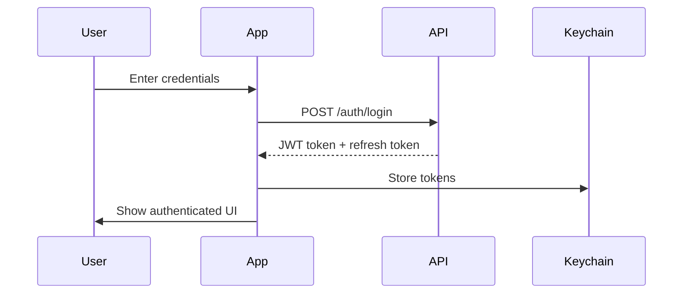

# API Integration Guide

This guide covers all API integrations in the Leavn Super Official app, including setup, usage, and best practices.

## Table of Contents

- [Overview](#overview)
- [ESV API Integration](#esv-api-integration)
- [ElevenLabs API Integration](#elevenlabs-api-integration)
- [Community Backend API](#community-backend-api)
- [Authentication Flow](#authentication-flow)
- [Error Handling](#error-handling)
- [Rate Limiting](#rate-limiting)
- [Testing APIs](#testing-apis)
- [Security Best Practices](#security-best-practices)

## Overview

The app integrates with several external APIs:

1. **ESV API** - Bible text and search (Required)
2. **ElevenLabs API** - Text-to-speech (Optional)
3. **Community Backend** - Social features (Internal)

All API integrations follow consistent patterns:
- Async/await for all calls
- Proper error handling
- Secure credential storage
- Rate limit awareness

## ESV API Integration

### Setup

1. **Get API Key**
   - Visit [api.esv.org](https://api.esv.org)
   - Sign up for free account
   - Generate API key
   - Free tier: 5,000 requests/day

2. **Configure in App**
   ```swift
   // Stored securely in Keychain
   try await apiKeyManager.setESVAPIKey("your-api-key")
   ```

### Implementation

#### Client Structure

```swift
public struct ESVClient {
    public var getPassage: @Sendable (Book, Int, Int?) async throws -> ESVResponse
    public var search: @Sendable (String) async throws -> [SearchResult]
}
```

#### Getting Bible Passages

```swift
// Request a chapter
let response = try await esvClient.getPassage(.john, 3, nil)

// Request a specific verse
let response = try await esvClient.getPassage(.john, 3, 16)

// Response structure
struct ESVResponse {
    let query: String      // "John 3:16"
    let text: String       // Actual verse text
    let verseNumbers: Bool // Include verse numbers
}
```

#### Search Functionality

```swift
// Search for text
let results = try await esvClient.search("love")

// Results include
struct SearchResult {
    let reference: BibleReference  // Book, chapter, verse
    let text: String              // Verse content
    let context: String           // Surrounding context
}
```

### API Parameters

#### Passage Text Parameters

| Parameter | Type | Description | Default |
|-----------|------|-------------|---------|
| `q` | String | Query (e.g., "John 3:16") | Required |
| `include-passage-references` | Bool | Include reference | false |
| `include-verse-numbers` | Bool | Show verse numbers | true |
| `include-footnotes` | Bool | Include footnotes | false |
| `include-headings` | Bool | Section headings | true |
| `include-short-copyright` | Bool | Copyright notice | false |

#### Search Parameters

| Parameter | Type | Description | Default |
|-----------|------|-------------|---------|
| `q` | String | Search query | Required |
| `page-size` | Int | Results per page | 20 |
| `page` | Int | Page number | 1 |

### Rate Limits

- **Free Tier**: 5,000 requests/day
- **Reset**: Midnight PST
- **Headers**: Check `X-Rate-Limit-Remaining`

## ElevenLabs API Integration

### Setup

1. **Get API Key**
   - Visit [elevenlabs.io](https://elevenlabs.io)
   - Create account (paid plans available)
   - Generate API key

2. **Configure in App**
   ```swift
   try await apiKeyManager.setElevenLabsAPIKey("your-api-key")
   ```

### Implementation

#### Client Structure

```swift
public struct ElevenLabsClient {
    public var textToSpeech: @Sendable (String, VoiceSettings) async throws -> Data
    public var getVoices: @Sendable () async throws -> [Voice]
}
```

#### Text-to-Speech

```swift
// Convert text to audio
let audioData = try await elevenLabsClient.textToSpeech(
    "In the beginning was the Word",
    VoiceSettings(
        voiceId: "21m00Tcm4TlvDq8ikWAM",
        stability: 0.5,
        similarityBoost: 0.5
    )
)

// Play audio
audioService.play(audioData)
```

#### Voice Management

```swift
// Get available voices
let voices = try await elevenLabsClient.getVoices()

// Voice structure
struct Voice {
    let voiceId: String
    let name: String
    let category: String
    let description: String
    let previewUrl: String?
}
```

### API Parameters

#### Text-to-Speech Parameters

| Parameter | Type | Description | Range |
|-----------|------|-------------|-------|
| `text` | String | Text to convert | Max 5000 chars |
| `voice_id` | String | Voice identifier | Required |
| `stability` | Float | Voice consistency | 0.0 - 1.0 |
| `similarity_boost` | Float | Voice clarity | 0.0 - 1.0 |
| `model_id` | String | TTS model | "eleven_monolingual_v1" |

### Rate Limits

- Based on subscription plan
- Character limits per month
- Concurrent request limits

## Community Backend API

### Overview

Internal API for community features:
- Prayer wall
- Study groups
- Activity feed
- User profiles

### Authentication

```swift
// Login
let token = try await authClient.login(username, password)

// Register
let user = try await authClient.register(
    username: username,
    email: email,
    password: password
)

// Token refresh
let newToken = try await authClient.refreshToken(currentToken)
```

### WebSocket Connection

```swift
// Connect for real-time updates
webSocketService.connect(token: authToken)

// Subscribe to events
webSocketService.subscribe(to: .prayers) { event in
    // Handle new prayers
}

// Send messages
webSocketService.send(.prayerCreated(prayer))
```

### API Endpoints

#### Prayer Wall

```swift
// Get prayers
GET /api/prayers
Query: page, limit, filter

// Create prayer
POST /api/prayers
Body: { title, content, anonymous }

// Update prayer count
POST /api/prayers/:id/pray
```

#### Study Groups

```swift
// List groups
GET /api/groups
Query: category, search, page

// Join group
POST /api/groups/:id/join

// Leave group
DELETE /api/groups/:id/leave
```

#### Activity Feed

```swift
// Get feed
GET /api/feed
Query: page, limit, type

// Post activity
POST /api/activities
Body: { type, content, metadata }
```

## Authentication Flow

### Initial Setup



### Token Management

```swift
// Token storage
extension AuthClient {
    func storeTokens(_ tokens: AuthTokens) async throws {
        try await keychain.set(tokens.access, for: .accessToken)
        try await keychain.set(tokens.refresh, for: .refreshToken)
    }
}

// Automatic refresh
struct AuthInterceptor {
    func intercept(_ request: URLRequest) async throws -> URLRequest {
        var request = request
        
        if let token = try? await keychain.get(.accessToken) {
            request.setValue("Bearer \(token)", forHTTPHeaderField: "Authorization")
        }
        
        return request
    }
}
```

## Error Handling

### Error Types

```swift
enum APIError: LocalizedError {
    case unauthorized
    case rateLimitExceeded
    case networkError(Error)
    case invalidResponse
    case missingAPIKey
    
    var errorDescription: String? {
        switch self {
        case .unauthorized:
            return "Please log in again"
        case .rateLimitExceeded:
            return "Too many requests. Please try again later"
        case .networkError(let error):
            return "Network error: \(error.localizedDescription)"
        case .invalidResponse:
            return "Invalid response from server"
        case .missingAPIKey:
            return "API key required. Please add in Settings"
        }
    }
}
```

### Error Handling Pattern

```swift
// In reducer
case .loadPassage:
    return .run { send in
        do {
            let passage = try await esvClient.getPassage(book, chapter, verse)
            await send(.passageLoaded(passage))
        } catch APIError.rateLimitExceeded {
            await send(.showError("Daily limit reached. Try again tomorrow"))
        } catch APIError.missingAPIKey {
            await send(.showAPIKeyPrompt)
        } catch {
            await send(.showError(error.localizedDescription))
        }
    }
```

## Rate Limiting

### Implementation

```swift
struct RateLimiter {
    private let maxRequests: Int
    private let timeWindow: TimeInterval
    private var requests: [Date] = []
    
    mutating func shouldAllow() -> Bool {
        let now = Date()
        requests = requests.filter { now.timeIntervalSince($0) < timeWindow }
        
        if requests.count < maxRequests {
            requests.append(now)
            return true
        }
        
        return false
    }
}
```

### Usage

```swift
// Check before making request
if rateLimiter.shouldAllow() {
    let response = try await api.makeRequest()
} else {
    throw APIError.rateLimitExceeded
}
```

## Testing APIs

### Mock Clients

```swift
extension ESVClient {
    static let mock = Self(
        getPassage: { _, _, _ in
            ESVResponse(
                query: "John 3:16",
                text: "For God so loved the world...",
                verseNumbers: true
            )
        },
        search: { _ in
            [SearchResult(
                reference: .init(book: .john, chapter: 3, verse: 16),
                text: "For God so loved the world...",
                context: "John 3"
            )]
        }
    )
}
```

### Integration Tests

```swift
class APIIntegrationTests: XCTestCase {
    func testESVPassageLoading() async throws {
        // Use real API with test key
        let client = ESVClient.liveValue
        
        let response = try await client.getPassage(.genesis, 1, 1)
        
        XCTAssertEqual(response.query, "Genesis 1:1")
        XCTAssertTrue(response.text.contains("In the beginning"))
    }
}
```

## Security Best Practices

### 1. Secure Storage

```swift
// Never store API keys in code
// ❌ Bad
let apiKey = "sk_live_1234567890"

// ✅ Good
let apiKey = try await keychain.get(.esvAPIKey)
```

### 2. Certificate Pinning

```swift
// Pin certificates for sensitive endpoints
let pinnedCertificates = [
    "api.esv.org": "sha256/AAAA...",
    "api.elevenlabs.io": "sha256/BBBB..."
]
```

### 3. Request Signing

```swift
// Sign requests when required
func signRequest(_ request: URLRequest) -> URLRequest {
    var request = request
    let signature = generateSignature(request)
    request.setValue(signature, forHTTPHeaderField: "X-Signature")
    return request
}
```

### 4. API Key Rotation

```swift
// Support key rotation
struct APIKeyRotation {
    func rotateIfNeeded() async throws {
        let lastRotation = try await keychain.get(.lastKeyRotation)
        if shouldRotate(lastRotation) {
            let newKey = try await api.generateNewKey()
            try await keychain.set(newKey, for: .apiKey)
        }
    }
}
```

### 5. Audit Logging

```swift
// Log API access for security
struct APIAuditLog {
    func log(_ endpoint: String, status: Int) {
        let entry = AuditEntry(
            endpoint: endpoint,
            timestamp: Date(),
            status: status,
            userId: currentUser?.id
        )
        logger.log(entry)
    }
}
```

## Best Practices Summary

1. **Always use HTTPS** for all API calls
2. **Store credentials securely** in Keychain
3. **Handle errors gracefully** with user-friendly messages
4. **Respect rate limits** to avoid service disruption
5. **Cache responses** when appropriate
6. **Use dependency injection** for testability
7. **Monitor API usage** and performance
8. **Document all integrations** thoroughly
9. **Version your API calls** for compatibility
10. **Test both success and failure** scenarios

---

For implementation examples, see the source code in `Sources/LeavnApp/Services/`.